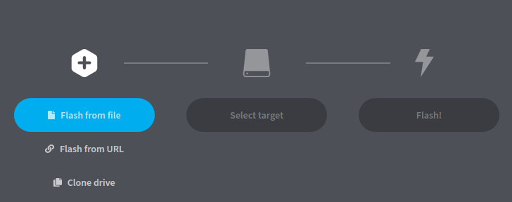

Matériel un OrangePi5Plus lien fournisseur officiel version 16Gb DDR4:

Une alimentation adaptée (IMPORTANT !!!!!) celle-ci par exemple attention aussi à bien prendre la "couleur" EU dans AliExpress (vous risquez d'avoir du mal à brancher un plrise américaine !)

Télécharger balenaEtcher pour Windows:

Télécharger l'image OPi5Plus_Media_Center 

Une fois téléchargé,ouvrir balena etcher :

Après selectionner "Flash From file"
Séléctionnez votre carte SD
FLASH
Mettez votre carte SD sur l'OrangePi

!! Il n'y a pas de jeux ni de source pour les chaines vous devez donc les trouver vous même...
L'image est faite pour qu'un support NVMe se monte directement sur /home/paris/Retropie
vous devez donc avoir dans le NVMe un dossier roms avec le nom de vos consoles exemple (nvme_root)/roms/n64/mario_kart.n64 qui sera automatiquement monté sur /home/paris/Retropie/roms/n64/mario_kart.n64
